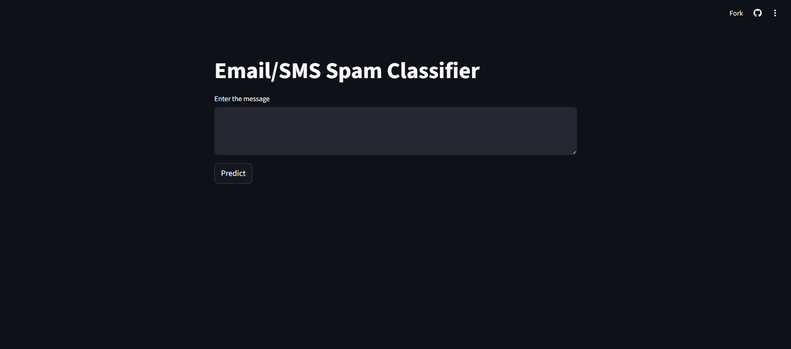
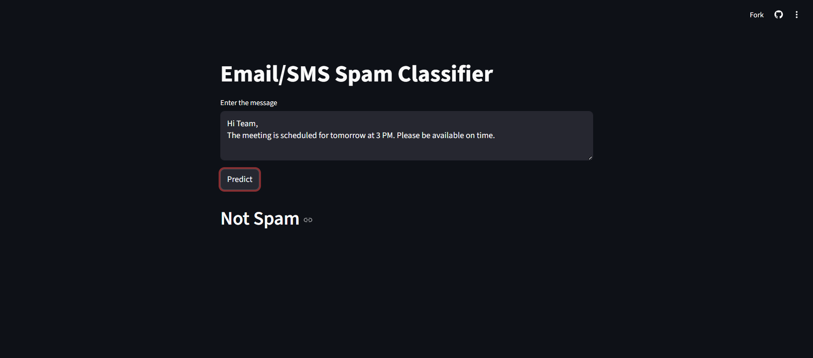
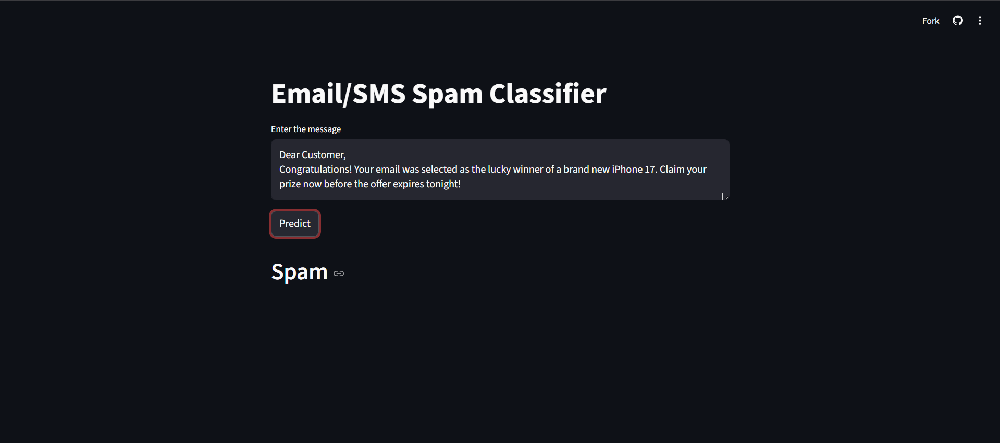

# 📩 SMS / Email Spam Classifier

A machine learning web app that detects whether a message is **Spam** or **Ham (Not Spam)** using Natural Language Processing and a Naive Bayes classifier — built with Python and deployed via Streamlit.

---

## 🚀 Live Demo

👉 [Click here to try the app](https://aq6grlwz9isevu4pr2kmjw.streamlit.app)

---
## Screenshots

### App Overview


### Ham (Legitimate Message)


### Spam Detection



## 🧠 How It Works
```
User Input → Text Preprocessing → TF-IDF Vectorization → MultinomialNB Model → Spam / Ham
```

- **Text Preprocessing** — Lowercasing, tokenization, removing stopwords & punctuation, stemming
- **Vectorization** — TF-IDF with `max_features=3000`
- **Prediction** — Multinomial Naive Bayes classifier
- **Result** — Displays `Spam` or `Not Spam`

---

## 🗂️ Project Structure
```
Email-spam-classifier/
├── app.py                        # Streamlit web app
├── sms-spam-detection.ipynb      # Model training notebook
├── vectorizer.pkl                # Saved TF-IDF vectorizer
├── model.pkl                     # Saved trained model
├── spam.csv                      # Dataset
└── requirements.txt              # Python dependencies
```

---

## 📊 Dataset

- **Source:** UCI SMS Spam Collection Dataset
- **Size:** 5,572 messages
- **Classes:** Ham (87%) and Spam (13%)

---

## ⚙️ Tech Stack

| Layer | Technology |
|---|---|
| Language | Python 3 |
| Web App | Streamlit |
| ML Library | Scikit-learn |
| NLP | NLTK |
| Model | Multinomial Naive Bayes |
| Vectorizer | TF-IDF |
| Deployment | Streamlit Community Cloud |

---

## 🔧 Installation & Running Locally

1. **Clone the repository**
```bash
git clone https://github.com/crazyshubham/Email-spam-classifier.git
cd Email-spam-classifier
```

2. **Create a virtual environment**
```bash
python -m venv .venv
.venv\Scripts\activate        # Windows
source .venv/bin/activate     # Mac/Linux
```

3. **Install dependencies**
```bash
pip install -r requirements.txt
```

4. **Run the app**
```bash
streamlit run app.py
```

---

## 📦 Requirements
```
streamlit
scikit-learn
nltk
numpy
pandas
```

---

## 🧪 Model Performance

| Model | Accuracy | Precision |
|---|---|---|
| Multinomial Naive Bayes | ~97% | ~100% |
| Bernoulli Naive Bayes | ~97% | ~98% |
| Gaussian Naive Bayes | ~87% | ~68% |

> ✅ **MultinomialNB** was selected for its highest precision — minimizing false spam detection.

---

## 📝 Text Preprocessing Pipeline
```python
def transform_text(text):
    text = text.lower()                       # Lowercase
    text = nltk.word_tokenize(text)           # Tokenize
    # Remove non-alphanumeric
    # Remove stopwords & punctuation
    # Apply Porter Stemming
    return " ".join(text)
```

---

## ☁️ Deployment on Streamlit Cloud

1. Push code to GitHub
2. Go to [share.streamlit.io](https://share.streamlit.io)
3. Connect your GitHub repo
4. Set `app.py` as the main file
5. Click **Deploy** 🚀

---

## 👨‍💻 Author

**Shubham Upadhyay**  
GitHub: [@crazyshubham](https://github.com/crazyshubham)

---

## 📄 License

This project is open source and available under the [MIT License](LICENSE).
